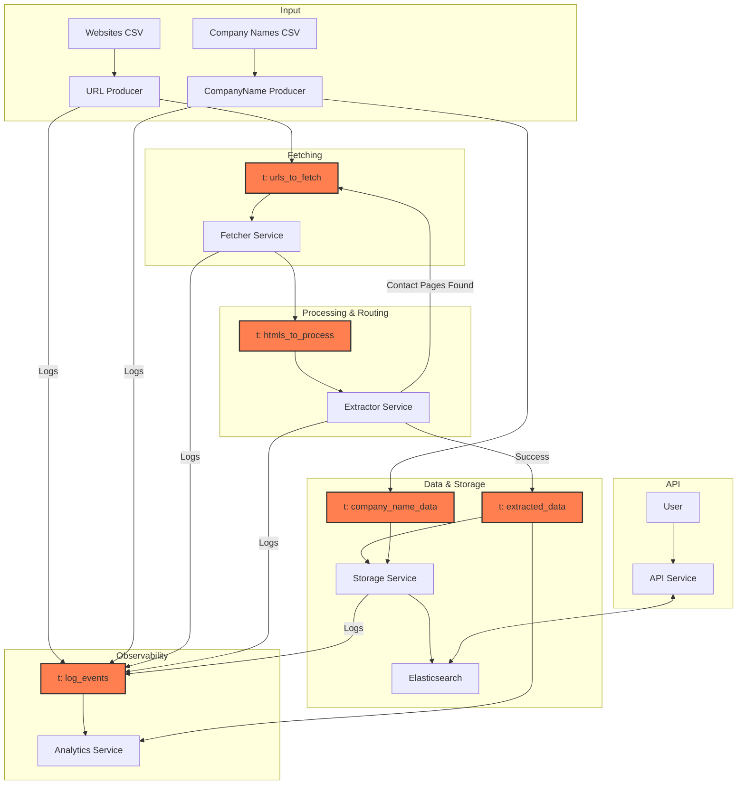

# Scalable Web Scraper and Company Data Matching API

This project is a distributed data pipeline built in Python. It takes a list of websites, scrapes them to extract structured company contact information, enriches this data with information from other sources, stores the unified record in Elasticsearch and exposes an API to find the best-matching company profile for a given input.

The entire system is orchestrated with Docker and uses Kafka for robust, asynchronous communication between services.

## Core Features

-   **Distributed Architecture:** Services are decoupled using Kafka, allowing for independent scaling and resilience.
-   **Deep Site Scraping:** The `Extractor Service` discovers links to contact pages and re-queues them, allowing the `Fetcher` to scrape deeper into a website to find the most valuable data.
-   **Data Enrichment from Multiple Sources:** The system merges data from multiple streams. It combines data scraped from websites with supplementary data (like official company names) provided via a separate CSV, creating a more complete and accurate final record.
-   **Robust Data Storage & Search:** Uses Elasticsearch to store company records and provide powerful full-text search and matching capabilities.
-   **Data Normalization:** Enriches the stored data with normalized fields (E.164 for phone numbers, clean domains, social media profile IDs) to achieve a high match rate.
-   **Smart Matching API:** A FastAPI endpoint that uses a weighted, multi-field query to find the single best-matching company profile.
-   **Fully Containerized:** The entire application stack is defined and managed by Docker Compose for easy setup and deployment.
-   **Observability:** Includes a dedicated logging service and an analytics service to monitor pipeline health and performance.

## System Architecture

The pipeline is composed of several microservices communicating through Kafka topics. The `Storage Service` acts as the point of data unification before persistence.



## Architectural Decisions

The architecture of this project was chosen to prioritize scalability, resilience and maintainability.

-   **Why Kafka? (Decoupling and Asynchronicity)**
    -   Kafka acts as a durable buffer between services. If the `ExtractorService` crashes, the `FetcherService` can continue to produce messages without data loss. Once the `ExtractorService` restarts, it will resume processing from where it left off. This is crucial for a long-running scraping job.
    -   Each service can be scaled independently. If fetching becomes a bottleneck, we can scale up the number of `fetcher` service containers without touching any other part of the system.
    -   It prevents backpressure. If the `ExtractorService` is slower than the `FetcherService`, messages will simply accumulate in the `htmls_to_process` topic without overwhelming the extractor service's memory.

-   **Why is the contact page logic in the Extractor? (Single Responsibility & Centralized Logic)**
    -   Separation of concerns - the fetcher's job is to fetch HTML pages; the extractor's job is to understand HTML content.

-   **Why a dedicated Storage Service? (Data Merging and Abstraction)**
    -   This service's main responsibility is to communicate with the persistent storage layer (Elasticsearch). It handles database-specific logic like index creation, schema mapping and update/insert (upsert) operations. This decouples all other services from the implementation details of the database.
    -   This service also acts as a **data fusion point**. It consumes from both the `extracted_data` topic (from the scraper) and the `company_name_data` topic (from a CSV) and merges them into a single company record in Elasticsearch using the domain as the primary key. This design makes it easy to plug in new data sources in the future.

-   **Why Elasticsearch? (From Storage to Search)**
    -   For the final goal of matching company profiles, a standard relational database is insufficient.
    -   Elasticsearch's powerful text analysis, inverted index and relevance scoring are purpose-built for these kind of fuzzy search and matching problems, providing both the speed and the capabilities required for a high match rate.

## Technology Stack

-   **Backend:** Python 3.10+
-   **Messaging Queue:** Apache Kafka
-   **Database/Search Index:** Elasticsearch
-   **API Framework:** FastAPI
-   **Web Fetching:** `aiohttp`
-   **Orchestration:** Docker & Docker Compose
-   **Key Python Libraries:** `confluent-kafka`, `elasticsearch-py`, `phonenumbers`, `beautifulsoup4`, `uvicorn`.

## Setup and Installation

### Prerequisites

-   [Docker](https://docs.docker.com/get-docker/)
-   [Docker Compose](https://docs.docker.com/compose/install/)
-   Python 3.10+ (for running local test scripts)

### Installation Steps

1.  **Clone the repository:**
    ```bash
    git clone <your-repo-url>
    cd <your-repo-directory>
    ```

2.  **Prepare Input Data:**
    -   Place the list of websites to be scraped in `data/sample-websites.csv`. It must have a header row with a `domain` column.
    -   Place the list of known company names in `data/sample-websites-company-names.csv`. The header row must contain `domain`, `company_commercial_name`, `company_legal_name` and `company_all_available_names`.

3.  **Install Python dependencies:**
    These are required for running the local API testing script.
    ```bash
    pip install -r requirements.txt
    ```

## How to Run the Pipeline

1.  **Start the entire application stack:**
    From the root directory, run the following command. The `--build` flag is necessary the first time or after changing dependencies.
    ```bash
    docker-compose up --build
    ```
    This will start all services, including Kafka, Elasticsearch and the application microservices, in the foreground.

2.  **To run in detached mode (in the background):**
    ```bash
    docker-compose up --build -d
    ```

3.  **To shut down the entire stack:**
    ```bash
    docker-compose down -v
    ```

## Usage

### Kicking off the Data Ingestion Process

The `url_producer` and `company_name_data_producer` services are configured to run once upon startup and then exit. They read from their respective CSV files in the `data/` directory and seed the pipeline. The scraping and processing will begin automatically as soon as the services are up.

### Using the Matching API

The API service is exposed on your local machine at port `8000`.

#### Interactive API Documentation

FastAPI provides automatic, interactive API documentation. Once the services are running, navigate to:

**[http://localhost:8000/docs](http://localhost:8000/docs)**

You can see the endpoint, its required schema and test it directly from your browser.

#### `POST /match` Endpoint

This endpoint accepts a JSON object with one or more fields and returns the single best-matching company profile.

-   **URL:** `http://localhost:8000/match`
-   **Method:** `POST`
-   **Request Body:**

    ```json
    {
      "name": "Company Name",
      "phone": "+15551234567",
      "website": "example.com",
      "input_facebook": "https://facebook.com/example"
    }
    ```

#### `curl` Example

```bash
curl -X POST "http://localhost:8000/match" \
-H "Content-Type: application/json" \
-d '{
  "website": "steppir.com"
}'
```

-   **Success Response (`200 OK`):** Returns the JSON object of the matched company profile.
-   **Not Found Response (`404 Not Found`):** Returned if no suitable match is found in the database.

## Testing the API

A script is provided to test the match rate of the API against a sample input file.

1.  **Prepare Test Data:** Ensure the `data/API-input-sample.csv` file exists.
2.  **Run the Test Script:** Make sure the Docker stack is running, then execute the script in a separate terminal.
    ```bash
    python test_api_script.py
    ```
    The script will log its progress and output a final match rate report. This is the key metric for evaluating and tuning the matching algorithm's performance.
3.  **Expected match rate report at time of writing:**
    ```bash
    2025-06-09 12:55:07 - INFO - Match Rate Report
    2025-06-09 12:55:07 - INFO - Total Test Cases:      32
    2025-06-09 12:55:07 - INFO - Successful Matches:    32
    2025-06-09 12:55:07 - INFO - Failed/No Matches:     0
    2025-06-09 12:55:07 - INFO - Overall Match Rate:  100.00%
    ```

## Performance Benchmarks

The following benchmarks were recorded to measure the pipeline's throughput and data acquisition effectiveness. Performance was measured on a system with the specified configuration, processing the full sample dataset of 997 unique domains.

### Test Environment

*   **Hardware:** Desktop PC (Ryzen 9 5900X, 32GB DDR4 RAM, NVMe SSD)
*   **Software:** Docker Desktop on Windows 10
*   **Pipeline Scale:** `docker compose up --build -d --scale fetcher-simple=8`
*   **Key Config:** `MAX_CONCURRENT_FETCHES=256`, `KAFKA_CONSUMER_BATCH_SIZE=256`, `URL_FETCH_TIMEOUT_SECONDS=15`

*Note: Runtimes and throughput are heavily dependent on network conditions, responsiveness of the target websites and the parameters showcased key configs.*

### Throughput

*   **End-to-End Pipeline Runtime:** Approximately **50 seconds** to process all 997 domains.
    *   This measures the time from the first URL being produced to the final record being processed by the storage service. The primary bottleneck is the `Fetcher` service, which is constrained by network I/O and server response times.

### Data Quality Metrics

These metrics are generated by the `AnalyticsService` and indicate the pipeline's overall success in acquiring and structuring data.

*   **Fetch Coverage:** **67.2%**
    *   *Definition:* The percentage of input domains for which the `Fetcher` successfully downloaded HTML content (670 out of 997). Failures are typically due to network timeouts, DNS errors, or server-side issues (e.g., 4xx/5xx status codes).

*   **Data Fill Rates:**
    *   *Definition:* The percentage of *total input domains* for which at least one instance of a specific data type was successfully extracted.
    *   **Phone Numbers:** **42.8%**
    *   **Social Media Links:** **35.4%**
    *   **Addresses:** **22.5%**

## Future Work & Potential Improvements

This project provides a solid foundation, but there are many ways it could be extended and improved:

-   **Proxy Integration & Rotation:** The Fetcher could integrate a proxy rotation service. This would make the system far more robust against IP blocks and rate limiting for large-scale scraping.

-   **Advanced Fetching Tier:** For websites that heavily rely on JavaScript to render content, a second, more powerful fetching tier could be added using a browser automation tool like `selenium` or `playwright`. Logic could be added to the `Extractor` to escalate fetching to this tier if the initial HTML is sparse.

-   **Kubernetes:** For a production-ready deployment, the application could be migrated from Docker Compose to Kubernetes for better orchestration, scaling and self-healing capabilities.

-   **Enhanced Data Extraction:** Current data extraction relies on regular expressions, which can be brittle. This could be improved by using more advanced techniques, including NLP models or third-party extraction services.

-   **Unit Tests:** The project currently lacks a comprehensive unit test suite. Adding unit tests for individual components (especially normalization and extraction logic) would improve reliability and make future development safer.

-   **CI/CD Pipeline:** Implement a continuous integration and deployment pipeline (e.g., using GitHub Actions) to automate testing, building and deploying Docker images to a container registry.

-   **Advanced Monitoring and Alerting:** While the `AnalyticsService` provides basic metrics, integrating with a monitoring stack like Prometheus and Grafana would provide deeper insights into pipeline performance, latency and error rates, with automated alerting.

## Bonus Task - Strategy for Measuring API Match Accuracy

A multi-step accuracy measurement system:

1. **Heuristic based accuracy:** Create a scoring system based on the strength of the signal present in the resulting match. For example:
* Normalized phone number match: +50 points
* Domain match: +40 points
* Normalized social media profile match: +30 points

2. **Manual sampling of matches:** At a certain time interval, randomly sample a small number of match results from the logs. Label these results manually, calculate the Confusion Matrix, adapt the heuristic based accuracy if needed and add the labeled
results to a dataset.

3. **Supervised learning ML model:** Use the created dataset to train a supervised ML model whose purpose is to classify if the results matches the input or not.