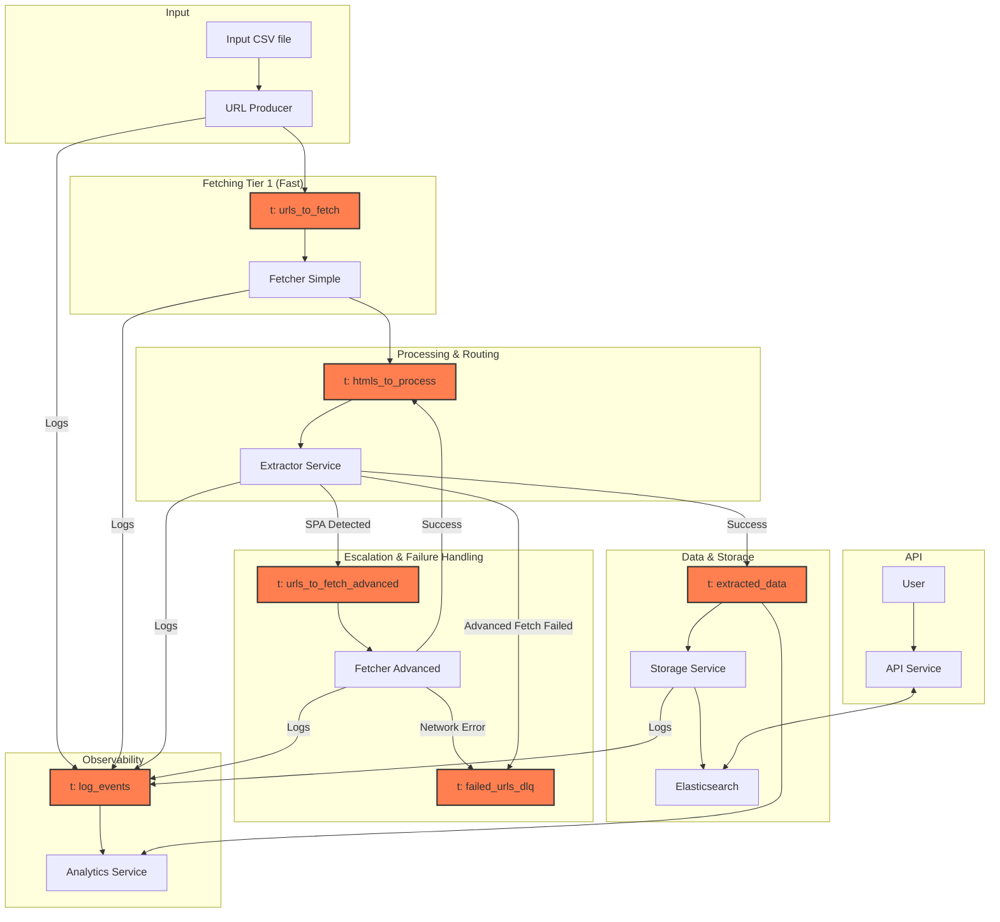

# Scalable Web Scraper and Company Data Matching API

This project is a distributed data pipeline built in Python. It takes a list of websites, scrapes them using a multi-tiered fetching strategy, extracts structured company contact information, stores it in Elasticsearch and exposes an API to find the best-matching company profile for a given input.

The entire system is orchestrated with Docker and uses Kafka for robust, asynchronous communication between services.

## Core Features

-   **Distributed Architecture:** Services are decoupled using Kafka, allowing for independent scaling and resilience.
-   **Multi-Tiered Fetching Strategy:**
    -   **Simple Fetcher:** A lightweight, high-performance asynchronous fetcher using `aiohttp`.
    -   **Advanced Fetcher:** A powerful, browser-based fetcher using `selenium-base` to render JavaScript and handle Single-Page Applications (SPAs).
-   **Escalation Logic:** The system automatically detects if a page is a likely SPA (based on content analysis) and escalates it from the simple to the advanced fetcher.
-   **Robust Data Storage & Search:** Uses Elasticsearch to store company records and provide powerful full-text search and matching capabilities.
-   **Data Normalization:** Enriches the stored data with normalized fields (E.164 for phone numbers, clean domains, social media profile IDs) to achieve a high match rate.
-   **Smart Matching API:** A FastAPI endpoint that uses a weighted, multi-field query to find the single best-matching company profile.
-   **Fully Containerized:** The entire application stack is defined and managed by Docker Compose for easy setup and deployment.
-   **Observability:** Includes a dedicated logging service and an analytics service to monitor pipeline health and performance.

## System Architecture

The pipeline is composed of several microservices communicating through Kafka topics. The `Extractor Service` acts as the central brain for routing and escalation.



## Architectural Decisions

The architecture of this project was deliberately chosen to prioritize scalability, resilience, and maintainability.

-   **Why Kafka? (Decoupling and Asynchronicity)**
    -   Kafka acts as a durable buffer between services. If the `ExtractorService` crashes, the `FetcherService` can continue to produce messages without data loss. Once the `ExtractorService` restarts, it will resume processing from where it left off. This is crucial for a long-running scraping job.
    -   Each service is a separate consumer group. If fetching becomes a bottleneck, we can scale up the number of `fetcher` service containers without touching any other part of the system. The same applies to the `extractor`, `storage`, or any other service.
    -  If the `ExtractorService` is slower than the `FetcherService` for example, messages will simply accumulate in the `htmls_to_process` topic without overwhelming the extractor service's memory.

-   **Why a Multi-Tiered Fetching Strategy? (Efficiency and Capability)**
    -   A simple, asynchronous `aiohttp` fetch that is fast and resource-efficient. A full browser fetch with Selenium is slow, CPU-intensive, and memory-heavy. By using the simple fetcher as the first line of attack, we process the vast majority of "easy" websites cheaply.
    -   We only use the expensive "advanced" fetcher when absolutely necessary, as determined by the `ExtractorService`. This targeted approach provides the power to handle complex JavaScript-driven sites without paying the performance penalty for every single URL.

-   **Why is the escalation logic in the Extractor? (Single Responsibility & Centralized Logic)**
    -   By moving the escalation logic from the fetcher to the extractor, we adhere to the Single Responsibility Principle. The fetcher's job is just to fetch; the extractor's job is to understand HTML.
    -   The `ExtractorService` is the only service that can definitively say, "This HTML is empty and contains no useful data." Placing the re-queueing logic here is more accurate and centralizes the complex decision-making process.

-   **Why a Storage Service? (Merging data from multiple streams)**
    -   This service's sole responsibility is to communicate with the persistent storage layer (Elasticsearch). It handles specific database logic like index creation and schema mapping. This decouples the `ExtractorService` from the implementation details of the database. If we decided to switch to a different database, only the `StorageService` would need to change.
    -   This design is powerful for future enhancements. Its role would be to **merge** different data streams into a single company record before saving the final document. This makes the architecture a plug-and-play system for future data sources.

-   **Why Elasticsearch? (Storage to Search)**
    -   For the final goal of matching company profiles, a standard relational database is insufficient.
    -   Elasticsearch's powerful text analysis, inverted index, and relevance scoring are purpose-built for this kind of search and matching problem, providing both the speed and the capabilities required for a high match rate.

## Technology Stack

-   **Backend:** Python 3.10+
-   **Messaging Queue:** Apache Kafka
-   **Database/Search Index:** Elasticsearch
-   **API Framework:** FastAPI
-   **Web Fetching:** `aiohttp` (simple), `selenium-base` (advanced)
-   **Orchestration:** Docker & Docker Compose
-   **Key Python Libraries:** `confluent-kafka`, `elasticsearch-py`, `phonenumbers`, `beautifulsoup4`, `uvicorn`.

## Setup and Installation

### Prerequisites

-   [Docker](https://docs.docker.com/get-docker/)
-   [Docker Compose](https://docs.docker.com/compose/install/)
-   Python 3.10+ (for running local test scripts)

### Installation Steps

1.  **Clone the repository:**
    ```bash
    git clone <your-repo-url>
    cd <your-repo-directory>
    ```

2.  **Prepare Input Data:**
    Place the list of websites to be scraped in the `data/sample-websites.csv` file. It must have a header row with at least a `domain` column.
    Place the list company names matched to domains in the `data/sample-websites-company-names.csv` file. The header row contains `domain`, `company_commercial_name`,`company_legal_name` and `company_all_available_names` columns.

3.  **Install Python dependencies:**
    These are required for running the local API testing script.
    ```bash
    pip install -r requirements.txt
    ```

## How to Run the Pipeline

1.  **Start the entire application stack:**
    From the root directory, run the following command. The `--build` flag is necessary the first time or after changing dependencies.
    ```bash
    docker-compose up --build
    ```
    This will start all services, including Kafka, Elasticsearch, and the application microservices, in the foreground.

2.  **To run in detached mode (in the background):**
    ```bash
    docker-compose up --build -d
    ```

3.  **To shut down the entire stack:**
    ```bash
    docker-compose down -v
    ```

## Usage

### Kicking off the Scraping Process

The `url_producer` service is configured to run once and then exit. It reads the URLs from `data/sample-websites.csv` and seeds the pipeline. The scraping and processing will begin automatically as soon as the services are up.

### Using the Matching API

The API service is exposed on your local machine at port `8000`.

#### Interactive API Documentation

FastAPI provides automatic, interactive API documentation. Once the services are running, navigate to:

**[http://localhost:8000/docs](http://localhost:8000/docs)**

You can see the endpoint, its required schema, and test it directly from your browser.

#### `POST /match` Endpoint

This endpoint accepts a JSON object with one or more fields and returns the single best-matching company profile.

-   **URL:** `http://localhost:8000/match`
-   **Method:** `POST`
-   **Request Body:**

    ```json
    {
      "name": "Company Name",
      "phone": "+15551234567",
      "website": "example.com",
      "input_facebook": "https://facebook.com/example"
    }
    ```

#### `curl` Example

```bash
curl -X POST "http://localhost:8000/match" \
-H "Content-Type: application/json" \
-d '{
  "website": "steppir.com"
}'
```

-   **Success Response (`200 OK`):** Returns the JSON object of the matched company profile.
-   **Not Found Response (`404 Not Found`):** Returned if no suitable match is found in the database.

## Testing the API

A script is provided to test the match rate of the API against a sample input file.

1.  **Prepare Test Data:** Ensure the `data/api_test_data.csv` file exists.
2.  **Run the Test Script:** Make sure the Docker stack is running, then execute the script in a separate terminal.
    ```bash
    python test_api_script.py
    ```
    The script will log its progress and output a final match rate report. This is the key metric for evaluating and tuning the matching algorithm's performance.
3.  **Expected match rate report at time of writing:**
    ```bash
    2025-06-09 12:55:07 - INFO - Match Rate Report
    2025-06-09 12:55:07 - INFO - Total Test Cases:      32
    2025-06-09 12:55:07 - INFO - Successful Matches:    31
    2025-06-09 12:55:07 - INFO - Failed/No Matches:     1
    2025-06-09 12:55:07 - INFO - Overall Match Rate:  96.88%
    ```

## Benchmarks


## Future Work & Potential Improvements

This project provides a solid foundation, but there are many ways it could be extended and improved:

-   **Proxy Integration & Rotation:** The Fetchers could integrate a proxy rotation. This would make the system far more robust against IP blocks.

-   **Kubernetes:** Solid choice to make the project truly production ready.

-   **Enhanced Data Extraction:** Current data extraction regex patterns still have bugs. It is very hard to create a perfect heuristic here, so enhancements in this area are plenty.

-   **Unit Tests:** The project has no unit tests. This is deliberate, as the focus was mostly on functionality.

-   **CI/CD Pipeline:** Implement a continuous integration and deployment pipeline (e.g., using GitHub Actions) to automate testing, building, and deploying Docker images to a container registry.

-   **Advanced Monitoring and Alerting:** While the `AnalyticsService` provides basic metrics, integrating with a monitoring stack like Prometheus and Grafana would provide deeper insights into pipeline performance.